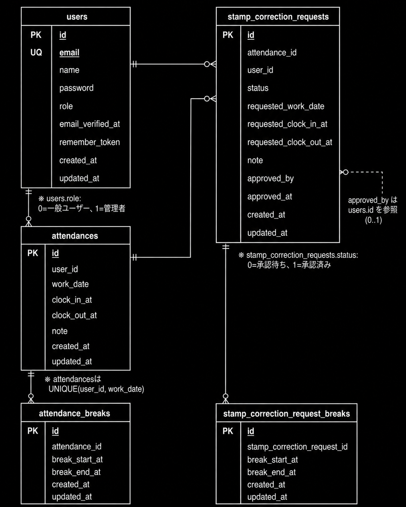

# 勤怠管理アプリ

## 環境構築

### Dockerビルド

1. `git clone https://github.com/tensho-takato/attendance_management.git`
2. DockerDesktopアプリを立ち上げる
3. クローンしたリポジトリのディレクトリに移動
4. `docker compose up -d --build`

MacのM1・M2チップのPCの場合、`no matching manifest for linux/arm64/v8 in the manifest list entries` のメッセージが表示されビルドができないことがあります。  
エラーが発生する場合は、`docker-compose.yml` ファイルの `mysql` 内に `platform` の項目を追加で記載してください。

```yaml
mysql:
  platform: linux/x86_64
  image: mysql:8.0.26
  environment:
```

### Laravel環境構築

1. `docker compose exec php bash`
2. `composer install`
3. `.env.example` ファイルを `.env` ファイルにコピー、または新しく `.env` ファイルを作成
4. `.env` に以下の環境変数を追加

```env
DB_CONNECTION=mysql
DB_HOST=mysql
DB_PORT=3306
DB_DATABASE=laravel_db
DB_USERNAME=laravel_user
DB_PASSWORD=laravel_pass

MAIL_MAILER=smtp
MAIL_HOST=mailhog
MAIL_PORT=1025
MAIL_USERNAME=null
MAIL_PASSWORD=null
MAIL_ENCRYPTION=null
MAIL_FROM_ADDRESS=hello@example.com
MAIL_FROM_NAME="${APP_NAME}"
```

5. アプリケーションキーの作成

```bash
php artisan key:generate
```

6. マイグレーションの実行

```bash
php artisan migrate
```

7. シーディングの実行

```bash
php artisan db:seed
```

## ダミーユーザー

シーディング実行後、以下のユーザーでログインできます。

### 管理者ユーザー

- メールアドレス：`admin@coachtech.com`
- パスワード：`password123`
- ログインURL：`http://localhost/admin/login`

### 一般ユーザー

- メールアドレス：`reina.n@coachtech.com`
- パスワード：`password123`
- ログインURL：`http://localhost/login`

その他の一般ユーザーも、パスワードはすべて `password123` です。

- `taro.y@coachtech.com`
- `issei.m@coachtech.com`
- `keikichi.y@coachtech.com`
- `tomomi.a@coachtech.com`
- `norio.n@coachtech.com`

## テストの実行

以下のコマンドでテストを実行できます。

```bash
php artisan config:clear
php artisan test
```

## 使用技術（実行環境）

- PHP 8.x
- Laravel 8.x
- MySQL 8.0.26
- Laravel Fortify
- Docker
- MailHog

## ER図



## URL

- 開発環境：http://localhost/
- phpMyAdmin：http://localhost:8080/
- MailHog：http://localhost:8025/